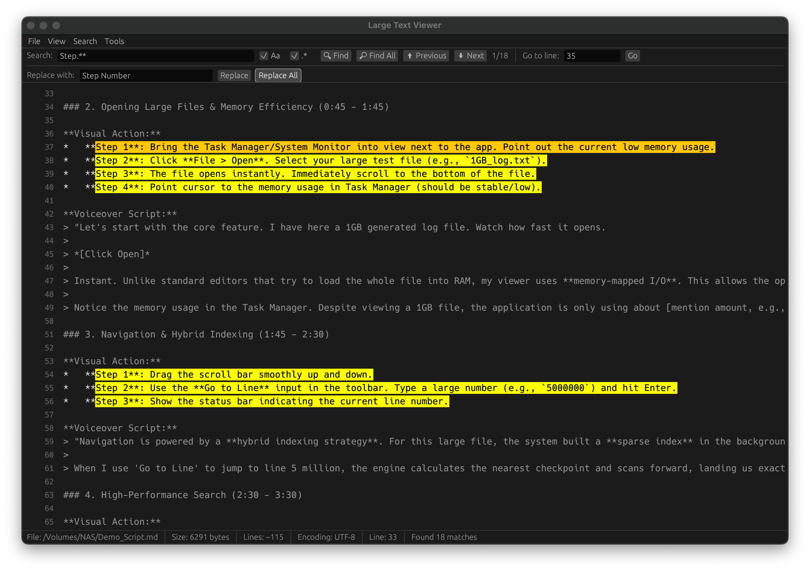
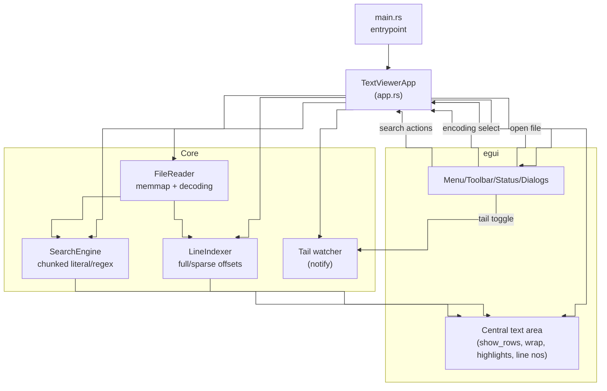
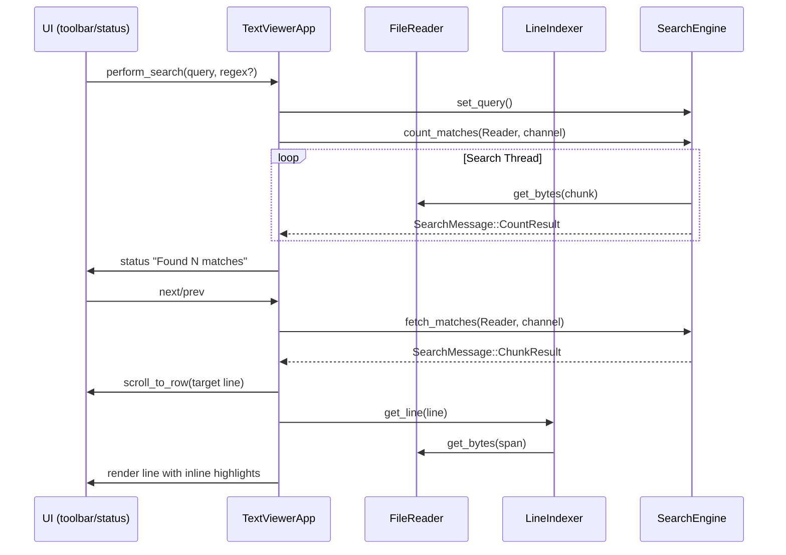

# High-Performance Large Text File Viewer in Rust
**ECE1724 Rust Course Project Final Report**


## Team Information

*   **Name**: Jarvis Wang
*   **Student Number**: 1004071602
*   **Preferred Email**: jarvis.wang@mail.utoronto.ca

---

## Motivation

In domains such as systems programming, data science, and DevOps, developers frequently interact with massive text files—server logs, database dumps, and simulation outputs—that can easily exceed gigabytes in size. Modern code editors like Visual Studio Code and Zed are optimized for code editing (AST parsing, syntax highlighting) rather than raw data throughput. Consequently, attempting to open a multi-gigabyte file often results in the editor freezing or crashing due to excessive memory consumption. This is a well-documented issue in the Zed editor community (see [Issue #4701](https://github.com/zed-industries/zed/issues/4701)).

Users are often forced to resort to command-line tools like `less` or `grep`, which, while efficient, lack the interactivity and convenience of a graphical user interface. There is a clear need for a tool that combines the performance of CLI utilities with the usability of a modern GUI. This project was motivated by the desire to solve this practical pain point using Rust's zero-cost abstractions and memory safety guarantees.

## Objectives

The primary objective of this project was to develop a high-performance GUI application capable of handling text files larger than 4GB with minimal resource usage. Specifically, the goals were:

1.  **Instant Access**: Open files >4GB instantly (<100ms) without loading the entire content into RAM.
2.  **Efficient Search**: Perform multi-threaded searches for literal strings and regular expressions with sub-second latency.
3.  **Safe Editing**: Enable content modification using atomic replace operations to ensure data integrity.
4.  **Low Memory Footprint**: Maintain a base memory usage of under 100MB, regardless of the file size.
5.  **Responsiveness**: Ensure the UI remains responsive (60 FPS) during heavy background operations.

The project serves as both a standalone application (crate: [`large-text-viewer`](https://crates.io/crates/large-text-viewer)) and a proof-of-concept backend (crate: [`large-text-core`](https://crates.io/crates/large-text-core)) for a future extension to the Zed editor.

## Features


The final deliverable offers the following key features:

1.  **Memory-Mapped File Viewing**: Utilizes `memmap2` to treat files as memory slices, allowing the OS to handle paging. This enables opening files larger than available RAM.
2.  **Hybrid Line Indexing**:
    *   **Full Index**: For small files (<10MB), provides exact line mapping.
    *   **Sparse Index**: For large files, uses a checkpoint-based system to keep index memory usage negligible (<1MB for 100GB files).
3.  **Virtual Scrolling**: Renders only the lines currently visible in the viewport, ensuring constant rendering performance.
4.  **Asynchronous Parallel Search**:
    *   Supports Case-Sensitive and Regex queries.
    *   "Find All" operations run on background threads without blocking the UI.
    *   Real-time progress reporting and result streaming.
5.  **Streaming Replace**:
    *   **In-Place**: Optimized replacement for same-length strings.
    *   **Copy-on-Write**: Safe, atomic replacement for different-length strings using temporary files.
    *   **Pending Replacements**: "Virtual editing" allows users to queue changes in memory before committing to disk.
6.  **Encoding Support**: Auto-detection and support for UTF-8, UTF-16 (LE/BE), and Windows-1252.

## Design and Implementation
The application follows a modular architecture, separating the core file processing logic from the user interface. This separation of concerns facilitates testing and future integration into other platforms (e.g., as a Zed extension).

### High-Level Components
The system is divided into two primary layers:

1.  **Core Layer (`large-text-core`)**:
    *   **`FileReader`**: Manages memory-mapped file access using the `memmap2` crate. It handles encoding detection and decoding, presenting a unified interface for byte-level access.
    *   **`LineIndexer`**: Responsible for mapping line numbers to byte offsets. It implements the hybrid indexing strategy to balance memory usage and access speed.
    *   **`SearchEngine`**: A parallelized search module that scans the memory-mapped file in chunks.
    *   **`Replacer`**: Handles file modifications, ensuring data integrity through copy-on-write mechanisms.

2.  **UI Layer (`large-text-viewer`)**:
    *   Built using `egui`, an immediate mode GUI library for Rust.
    *   **`TextViewerApp`**: The main application state manager. It handles user input, manages the viewport (virtual scrolling), and coordinates asynchronous tasks (search, replace) via channels.



### Data Flow
The application relies heavily on asynchronous communication to keep the UI responsive.
*   **Search**: The UI sends a query to the `SearchEngine`, which spawns threads. Results are streamed back to the UI via a `mpsc` channel (`SearchMessage::CountResult`, `SearchMessage::ChunkResult`), allowing the UI to update progress bars and highlight matches in real-time without blocking the render loop.


*   **Rendering**: The UI requests only the lines currently visible in the viewport. The `LineIndexer` calculates the byte ranges, and the `FileReader` decodes only those specific bytes from the memory map.


## User’s Guide

### 1. Installation & Launch
To install the application via Cargo, run the following command in your terminal (Windows, macOS, or Linux):
```bash
cargo install large-text-viewer
```
Once installed, start the application by typing:
```bash
large-text-viewer
```

### 2. Opening a File
*   Launch the application.
*   Click **File > Open...** in the menu bar.
*   Select any text file (no size limit). The file will load instantly.
*   *Note*: The status bar at the bottom displays the file size, estimated line count, and detected encoding.

### 3. Navigation
*   **Scroll**: Use the mouse wheel or the scroll bar on the right to navigate.
*   **Go to Line**: Enter a line number in the "Go to line" box in the toolbar and press Enter or click "Go".

### 4. Searching
*   Press **Ctrl+F** or click **Search > Find** to open the search toolbar.
*   Enter your query in the text box.
*   **Options**:
    *   Toggle **Aa** for Case Sensitivity.
    *   Toggle **.*** for Regular Expressions.
*   **Actions**:
    *   Click **Find** (or press Enter) to jump to the next match.
    *   Click **Find All** to count all matches in the file. The count will appear next to the search box (e.g., "1/1050").
    *   Use **Previous** / **Next** buttons to navigate through results.

### 5. Replacing
*   Press **Ctrl+R** or click **Search > Replace** to open the replace toolbar.
*   Enter the search term and the replacement text.
*   **Single Replace**: Click **Replace** to queue a change for the current match. This is a "pending" change and is not written to disk immediately.
*   **Replace All**: Click **Replace All**. You will be prompted to select an output file location. The operation will process the file in the background and write to the new file.

### 6. Saving Changes
*   If you have made single replacements, the window title will show an asterisk (*).
*   Click **File > Save (Ctrl+S)**.
*   You can overwrite the current file or save to a new path. Pending replacements will be applied during the save process.

## Reproducibility Guide

The instructor can follow these steps to build and run the project on Ubuntu Linux or macOS.

### 1. Prerequisites
Ensure the Rust toolchain is installed:
```bash
curl --proto '=https' --tlsv1.2 -sSf https://sh.rustup.rs | sh
source $HOME/.cargo/env
```

### 2. Build the Project
Clone this repo, navigate to the project root directory and build in release mode for optimal performance:
```bash
cd large-text-viewer
cargo build --release
```

### 3. Generate Test Files (Optional)
To test the large file capabilities, you can use the provided script to generate a large dummy file (e.g., 1GB):
```bash
# Make the script executable
chmod +x scripts/generate_test_files.sh
# Run the script (generates files in a 'test_files' directory)
./scripts/generate_test_files.sh
```
*Note: This script creates a few files of varying sizes for testing purposes.*

Or just simply run the unit test:
```bash
cargo test --workspace
```

### 4. Run the Application
Execute the binary:
```bash
cargo run --release
```
Or run the binary directly from the target folder:
```bash
./target/release/large-text-viewer
```

## Contributions by each team member

**Jarvis Wang (Solo Project)**
*   **Core Logic**: Designed and implemented the `large-text-core` library, including the `FileReader` (memmap2 integration), `LineIndexer` (hybrid sparse indexing algorithm), `SearchEngine` (multi-threaded chunk search), and `Replacer` (streaming copy-on-write logic).
*   **User Interface**: Built the `large-text-viewer` GUI using `egui`, implementing the virtual viewport rendering, event handling, and asynchronous state management.
*   **Testing & Documentation**: Wrote unit tests for core components, created the architecture documentation, and conducted performance benchmarking.
*   **CI/CD**: Built GitHub Actions workflows for automated testing, linting (clippy, cloc), and cross-platform builds (Windows, macOS, Ubuntu) to ensure code quality and portability as well as the release workflows to publish the app and crate packages to the [crates.io](https://crates.io/) registry.


## Lessons learned and concluding remarks

### Lessons Learned
1.  **The Complexity of Text Encoding**: Handling non-UTF-8 encodings in a memory-mapped environment proved challenging. Since Rust strings are strictly UTF-8, we had to implement a decoding layer that converts raw bytes from the memory map into Rust `String`s only for the visible viewport.
2.  **Sparse Indexing Precision**: Implementing the sparse index required careful mathematics. Estimating line numbers between checkpoints works well for navigation but makes exact line counting difficult. We learned to accept trade-offs (e.g., displaying "~10.5M lines") to achieve performance goals.
3.  **UI Responsiveness**: Initial implementations of the search feature blocked the main UI thread. Moving the search logic to a separate thread and using `std::sync::mpsc` channels was essential for a smooth user experience.

### Concluding Remarks
The "Large Text Viewer" project successfully demonstrates that Rust's zero-cost abstractions and memory safety guarantees make it an ideal language for high-performance systems tools. By combining memory-mapped I/O with a sparse indexing strategy, we created a tool that outperforms standard editors by orders of magnitude when handling large files. The project meets all primary objectives, delivering a robust, memory-efficient, and responsive application.

# Video Slide Presentation
[Large Text Viewer Slide Presentation](https://youtu.be/FL5U76ybcgc)
# Video Demo
[Large Text Viewer Video Demo](https://youtu.be/ial4q7573Qk)