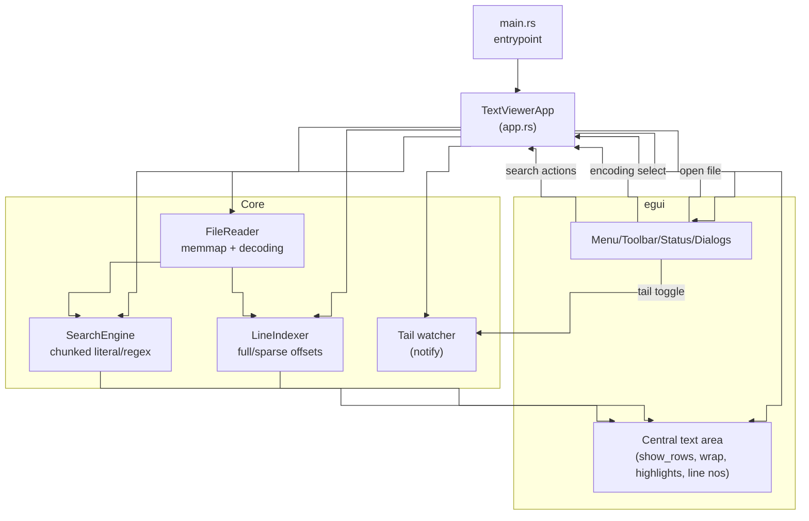
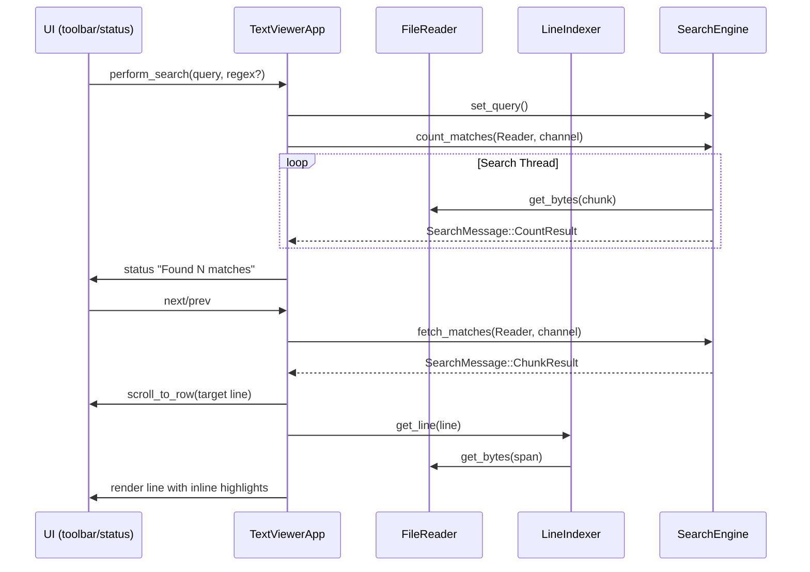
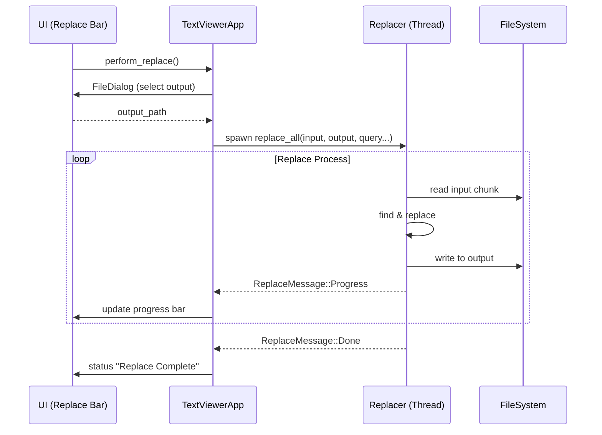
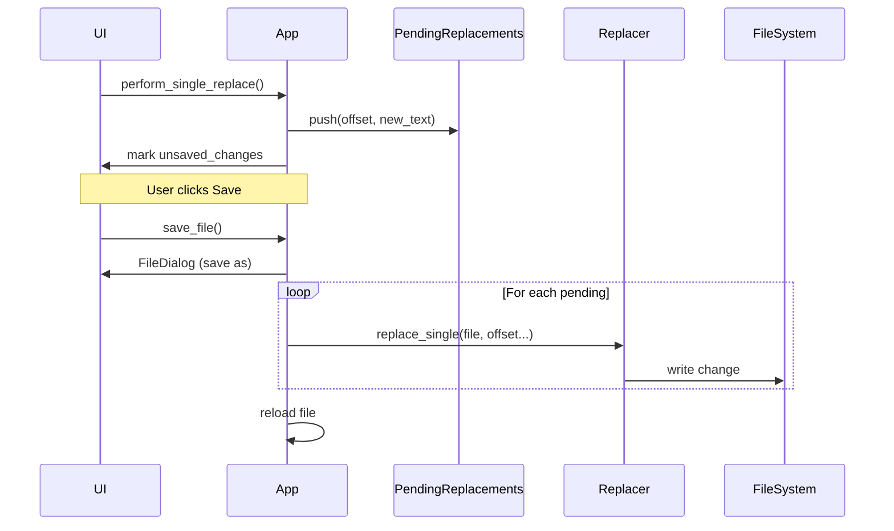

# Architecture and Design Document

## Overview

This document describes the architecture and design decisions for the Large Text File Viewer application.

## System Architecture

```
┌─────────────────────────────────────────────────────────────┐
│                         Main GUI                            │
│  ┌─────────────┐  ┌──────────────┐  ┌──────────────┐        │
│  │   Toolbar   │  │  Search Bar  │  │ Replace Bar  │        │
│  └─────────────┘  └──────────────┘  └──────────────┘        │
│  ┌─────────────────────────────────────────────────────┐    │
│  │           Viewport (50 lines at a time)             │    │
│  └─────────────────────────────────────────────────────┘    │
│  ┌─────────────────────────────────────────────────────┐    │
│  │               Navigation Controls                   │    │
│  └─────────────────────────────────────────────────────┘    │
└─────────────────────────────────────────────────────────────┘
                            │
                            ▼
┌─────────────────────────────────────────────────────────────┐
│                    Core Components                          │
│                                                             │
│  ┌──────────────────┐  ┌──────────────────┐                 │
│  │  FileHandler     │  │  Search Module   │                 │
│  │  - memmap2       │  │  - std::thread   │                 │
│  │  - Line indexing │  │  - Parallel scan │                 │
│  │  - Viewport mgmt │  │  - Regex support │                 │
│  └──────────────────┘  └──────────────────┘                 │
│                                                             │
│  ┌──────────────────┐                                       │
│  │  Editor Module   │                                       │
│  │  - Sequential    │                                       │
│  │  - Replace ops   │                                       │
│  │  - File I/O      │                                       │
│  └──────────────────┘                                       │
└─────────────────────────────────────────────────────────────┘
                            │
                            ▼
┌─────────────────────────────────────────────────────────────┐
│                    File System                              │
│             (Memory-mapped file via memmap2)                │
└─────────────────────────────────────────────────────────────┘
```

## Component Map


## Search/Data Flow


## Replace Data Flow

### Replace All (Streaming)


### Single Replace (Pending & Save)


## Notes
- File open: UI → open_file → FileReader mmap + LineIndexer index → status update.
- Rendering: visible rows only; LineIndexer supplies byte spans; FileReader decodes; UI draws text + per-match highlights.
- Tail mode: notify watcher reloads file, reindexes, and can auto-scroll to bottom.
- Encoding: selector swaps `selected_encoding` and reopens file.

## Key Design Decisions

### 1. Memory-Mapped I/O (memmap2)

**Decision**: Use `memmap2` for file access instead of traditional buffered I/O.

**Rationale**:
- **Efficiency**: The OS handles paging automatically, allowing efficient access to files larger than RAM
- **Performance**: Direct memory access is faster than repeated system calls
- **Simplicity**: No need to manage buffer sizes or complex caching strategies
- **Scalability**: Works seamlessly with files >4GB

**Implementation**:
```rust
pub struct FileHandler {
    mmap: Arc<Mmap>,           // Memory-mapped file
    line_offsets: Arc<Vec<usize>>,  // Index of line positions
    modified_lines: Arc<RwLock<HashMap<usize, String>>>,  // In-memory edits
}
```

### 2. Line Offset Indexing

**Decision**: Use a hybrid indexing strategy: full index for small files, sparse sampling for large files.

**Rationale**:
- **Fast Random Access**: Jump to any line in O(1) time for indexed lines
- **Memory Efficient**: Sparse sampling reduces memory usage for huge files
- **Performance**: Avoids reading the entire file for indexing if it's too large
- **Responsiveness**: Faster initial load time for large files

**Implementation**:
- **Small Files (<10MB)**: Full line index is built.
- **Large Files**: Sparse index (checkpoints) every 10MB. Line positions between checkpoints are estimated or scanned on demand.

**Trade-offs**:
- Exact line counts are estimated for large files
- Scrolling might be less precise in sparse regions

### 3. Viewport Rendering

**Decision**: Render only visible lines (default: 50 lines).

**Rationale**:
- **Memory Efficient**: Constant memory usage regardless of file size
- **Responsive UI**: Fast rendering even for huge files
- **Practical**: Users typically view one screen at a time

**Implementation**:
```rust
pub fn get_viewport_lines(&self, start_line: usize, count: usize) -> Vec<String> {
    let total_lines = self.total_lines();
    let end_line = (start_line + count).min(total_lines);

    (start_line..end_line)
        .filter_map(|i| self.get_line(i))
        .collect()
}
```

### 4. Parallel Search

**Decision**: Use `std::thread` to parallelize search across file chunks.

**Rationale**:
- **Performance**: Utilizes multiple CPU cores effectively
- **Control**: Manual chunking allows fine-grained control over memory usage and cancellation
- **Scalability**: Search time scales with number of cores

**Implementation**:
```rust
let num_threads = std::thread::available_parallelism()...;
let chunk_size = file_len.div_ceil(num_threads);

for i in 0..num_threads {
    thread::spawn(move || {
        // Search chunk
    });
}
```

**Chunk Size**: Calculated based on file size and thread count.
- Ensures even distribution of work
- Overlap handling ensures matches crossing chunk boundaries are found

### 5. Replace Strategy

**Decision**: Use in-place replacement for same-length strings, and copy-on-write (temp file) for different lengths.

**Rationale**:
- **Efficiency**: In-place replacement avoids rewriting the entire file
- **Safety**: Copy-on-write ensures data integrity for complex replacements
- **Simplicity**: Sequential processing avoids race conditions during write

**Implementation**:
1. **Same Length**: Open file in write mode, seek to offset, write new bytes.
2. **Different Length**:
   - Create temporary file
   - Copy data before match
   - Write replacement
   - Copy remaining data
   - Atomically replace original file

**Trade-offs**:
- Different length replacement requires disk space for temporary file
- Sequential processing might be slower for massive number of replacements compared to parallel, but is safer for file I/O

### 6. Pending Replacements Management

**Decision**: Track unsaved changes in a list of pending replacements.

**Rationale**:
- **Simplicity**: Easy to manage a list of changes before saving
- **Performance**: No need to modify the large file on disk for every keystroke
- **Undo/Redo Potential**: List structure facilitates future undo/redo implementation

**Implementation**:
```rust
struct PendingReplacement {
    offset: usize,
    old_len: usize,
    new_text: String,
}
// ...
pending_replacements: Vec<PendingReplacement>,
```

**Process**:
1. User edits text -> `PendingReplacement` added to list.
2. Viewport rendering applies pending replacements on top of file content.
3. On Save -> Iterate list and apply changes to disk using `Replacer`.

### 7. Regex vs Literal Search

**Decision**: Auto-detect search type based on regex validity.

**Rationale**:
- **User-Friendly**: No need to specify search mode
- **Performance**: Use faster literal search when possible
- **Flexibility**: Support both patterns seamlessly

**Implementation**:
```rust
let is_regex = Regex::new(query).is_ok();
if is_regex {
    search_regex(...)
} else {
    search_literal(...)
}
```

## Performance Characteristics

### Memory Usage

| File Size | Index Strategy | Index Memory | Total Memory (Idle/Scrolling) |
|-----------|----------------|--------------|-------------------------------|
| < 10 MB   | Full Index     | ~8 bytes/line| < 50 MB                       |
| 1 GB      | Sparse         | < 1 MB       | < 80 MB                       |
| 100 GB    | Sparse         | < 1 MB       | < 80 MB                       |

**Note**:
- **Base Memory**: Thanks to sparse indexing and memory mapping, the base memory footprint remains low (< 80 MB) even for extremely large files (100GB+).
- **Search Overhead**: During a "Find All" operation, memory usage may peak up to ~200 MB due to thread buffers and result collection, but returns to base levels afterwards.

### Search Performance

With 8 cores and 1000-line chunks:
- **Throughput**: ~8000 lines processed in parallel per iteration
- **Speedup**: Near-linear with core count for large files
- **Latency**: Minimal for files <1M lines, scales logarithmically

### Replace Performance

- **Sequential Processing**: Replacements are processed sequentially to ensure safe file I/O.
- **I/O Bound**: Performance is limited by disk read/write speeds.
- **Memory Efficient**: Streams data through small buffers, keeping memory usage low during replacement.

## Future Enhancements

### Potential Improvements

1. **Lazy Line Indexing**
   - Build index incrementally as file is explored
   - Faster startup for very large files
   - Trade-off: Slower first access to distant lines

2. **Virtual Scrolling**
   - More sophisticated viewport management
   - Smooth scrolling animations
   - Pre-fetch adjacent viewports

3. **Incremental Search**
   - Start searching before user finishes typing
   - Cancel previous searches when new query arrives
   - Progressive result display

4. **Undo/Redo**
   - Command pattern for edit operations
   - In-memory history for recent changes
   - Disk-based history for large modifications

5. **Syntax Highlighting**
   - Detect file type
   - Apply appropriate syntax highlighting
   - Use tree-sitter for parsing

6. **Split View**
   - Multiple viewports for same file
   - Compare different sections
   - Independent scrolling

## Testing Strategy

### Unit Tests

- File handler operations (basic, viewport, modifications)
- Search functionality (literal, regex)
- Replace operations (literal, regex)
- Edge cases (empty files, single line, no newline at EOF)

### Integration Tests

- End-to-end file operations
- GUI interactions (would require UI testing framework)
- Large file handling (>1GB files)

### Performance Tests

- Benchmark search on various file sizes
- Measure memory usage growth
- Test parallel efficiency

### Security Considerations

- Input validation for regex patterns
- Safe file system operations
- No buffer overflows (Rust's memory safety)
- Atomic file operations prevent corruption

## Conclusion

This architecture provides a solid foundation for efficiently viewing and editing multi-GB text files. The combination of memory-mapped I/O, viewport rendering, and parallel processing ensures good performance while maintaining low memory usage and a responsive user interface.